<!--
Animated contribution graph generated from public GitHub activity.
Automatically refreshed by .github/workflows/update-profile-art.yml
-->

<h3><code>nihaal@github ~ $ ./contributions.sh</code></h3>

 
 

<!--
Animated ASCII portrait beside the terminal-style information card.

Regenerate portrait:
python scripts/make_ascii_svg.py "local-input/portrait.jpg"

Regenerate information card:
python scripts/make_info_card.py
-->

<h3><code>nihaal@github ~ $ whoami</code></h3>

<table>
<tr>
<td valign="top">
  
</td>
<td valign="top">
  
</td>
</tr>
</table>

 
 

<h3><code>nihaal@github ~ $ ./links.sh</code></h3>

<b>CS Engineering Student · AI/ML & Full-Stack Developer</b>

 

